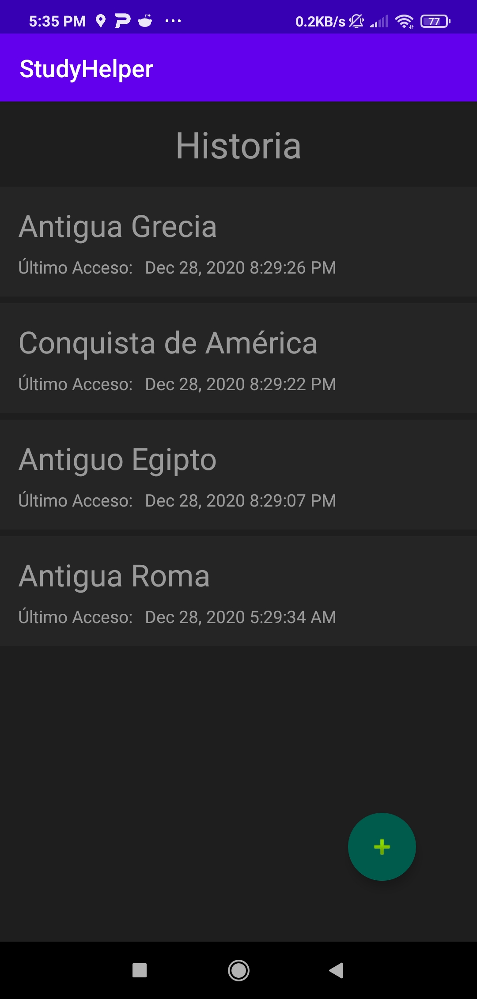

# Características
## Selección de materias y temas
La aplicación permite administrar materias y temas
 
 

## Panel de Temas
En el panel se puede acceder a las estadísticas de cada round de preguntas de ese tema, así como agregar, editar o borrar preguntas, y empezar un round de cuestionario.
 
 

## Agregado de preguntas
Se pueden agregar preguntas múltiple opción o verdadero/falso.
Cada pregunta tiene un puntaje diferente, y en el caso de las múltiple opción, las respuestas también pueden variar en puntaje
 
 
